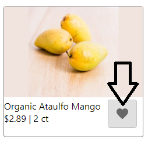
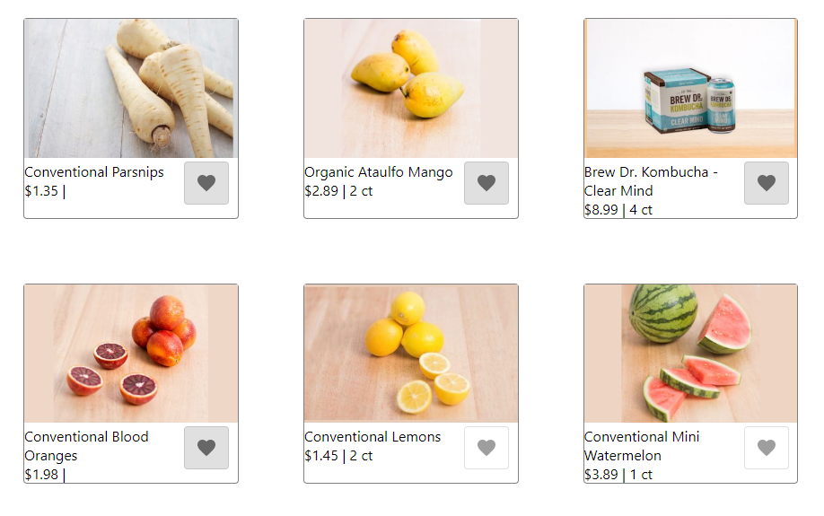

# Product Card Exercise with Event Sourced User Favorites

By [Anthony Zavala](https://www.linkedin.com/in/anthony-zavala-874a521b/)

## Instructions

1. Clone locally using  
    `git clone git@github.com:zavalaan/product-card-exercise.git`  
    or  
    `git clone https://github.com/zavalaan/product-card-exercise.git`
2. Install dependencies using `npm install` or ` npm i`
3. Run tests using `npm test`
4. Start the express server using `node src/api/server.js`
5. Start the react client (from a separate console, while the server is running) using `npm start`
6. Open [http://localhost:3000](http://localhost:3000) to view it in the browser.

[Create React App Instructions](#create-react-app-instructions)

## Requirements
### Code that demonstrates
- Asynchronous logic – any way in which program flow must react to a
non-immediate response in a non-blocking manner. Examples: HTTP requests,
callback/Promise/async-await, queue-based/distributed events.
- Data manipulation – any way in which one or many sources of data are combined,
split apart, or massaged into a new output data shape. Examples:
projecting/translating data to a new shape, normalizing data for in-memory
storage, UI derived from multiple data sources.
- Good communication – software development is a collaborative process, and others
will need to understand and maintain your code.

Keep it small in scope so that you can complete it within 2 hours.

## Discussion
I chose to implement user favorites. Giving customers a way to mark products so that they are saved.

The implemented feature can be utilized by clicking on the heart icon in each individual product card. Shaded means the product has been selected as a favorite.  


When the page is first loaded, your user is persisted in the browser's LocalStorage. Refreshing the page after some products have been selected will result in the favorites being displayed first.  


Implementing user favorites provided me we a path to showcase an in-memory event sourcing solution. Asynchronous logic is demonstrated using HTTP calls between the react client and the node server in order to get Product and User data, as well as post User commands. Additionally, if this were to be a production ready solution, I would also be emitting the user events on a message bus. Data manipulation is demonstrated by storing the user events individually and using a fold function to replay the events into the current state. The UI is also derived from multiple data sources by using the user's favorites to reorder the products on page load.

## Unhappy Paths
In order to keep the solution small, I mostly only accounted for the success cases. Here is a list of some considered but incomplete paths that I would complete if this solution was to be shipped into production.

- Failure events are returned from the API, but they are not displayed to the user. I would add a notification of failure to the UI.
- Retry logic when calls to the API fail.
- Real persistance, something that has quick lookup by key so that the event collections are returned quickly.
- A projector component that would create a view of the current user states, fed from a stream of events from a message bus. Replaying events on each get will begin to under perform quickly.

---

## Create React App Instructions:

This project was bootstrapped with [Create React App](https://github.com/facebook/create-react-app).

## Running

We added a separate express API to serve products to the client app.  To run that prior to kicking
off the webpack dev server running the react app:

```sh
# Run on a later version of node
# Runs on PORT 9001 by default, but can set the PORT env variable to run on a different port
$ node src/api/server.js
```

Then, move on to running the client below...

## Available Scripts

In the project directory, you can run:

### `npm start`

Runs the app in the development mode.<br>
Open [http://localhost:3000](http://localhost:3000) to view it in the browser.

The page will reload if you make edits.<br>
You will also see any lint errors in the console.

### `npm test`

Launches the test runner in the interactive watch mode.<br>
See the section about [running tests](https://facebook.github.io/create-react-app/docs/running-tests) for more information.

### `npm run build`

Builds the app for production to the `build` folder.<br>
It correctly bundles React in production mode and optimizes the build for the best performance.

The build is minified and the filenames include the hashes.<br>
Your app is ready to be deployed!

See the section about [deployment](https://facebook.github.io/create-react-app/docs/deployment) for more information.

### `npm run eject`

**Note: this is a one-way operation. Once you `eject`, you can’t go back!**

If you aren’t satisfied with the build tool and configuration choices, you can `eject` at any time. This command will remove the single build dependency from your project.

Instead, it will copy all the configuration files and the transitive dependencies (Webpack, Babel, ESLint, etc) right into your project so you have full control over them. All of the commands except `eject` will still work, but they will point to the copied scripts so you can tweak them. At this point you’re on your own.

You don’t have to ever use `eject`. The curated feature set is suitable for small and middle deployments, and you shouldn’t feel obligated to use this feature. However we understand that this tool wouldn’t be useful if you couldn’t customize it when you are ready for it.

## Learn More

You can learn more in the [Create React App documentation](https://facebook.github.io/create-react-app/docs/getting-started).

To learn React, check out the [React documentation](https://reactjs.org/).

### Code Splitting

This section has moved here: https://facebook.github.io/create-react-app/docs/code-splitting

### Analyzing the Bundle Size

This section has moved here: https://facebook.github.io/create-react-app/docs/analyzing-the-bundle-size

### Making a Progressive Web App

This section has moved here: https://facebook.github.io/create-react-app/docs/making-a-progressive-web-app

### Advanced Configuration

This section has moved here: https://facebook.github.io/create-react-app/docs/advanced-configuration

### Deployment

This section has moved here: https://facebook.github.io/create-react-app/docs/deployment

### `npm run build` fails to minify

This section has moved here: https://facebook.github.io/create-react-app/docs/troubleshooting#npm-run-build-fails-to-minify
